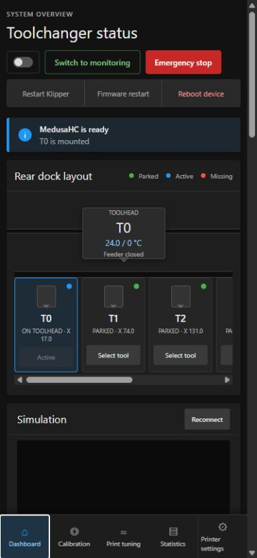
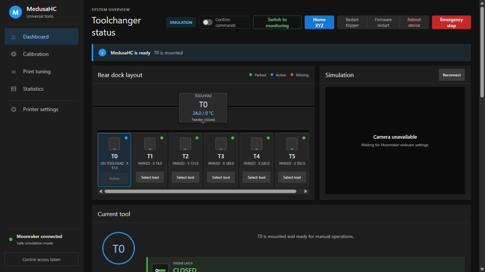
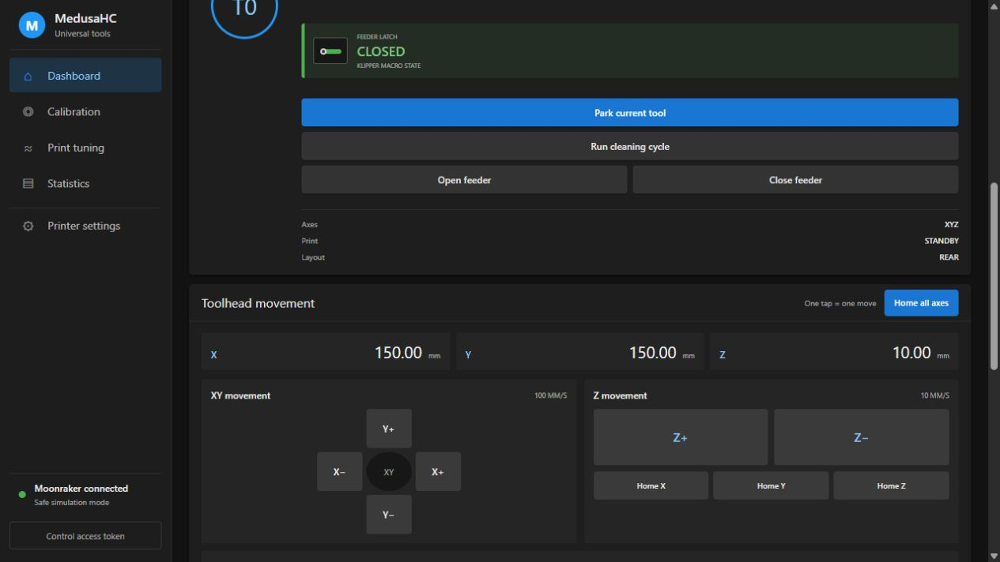
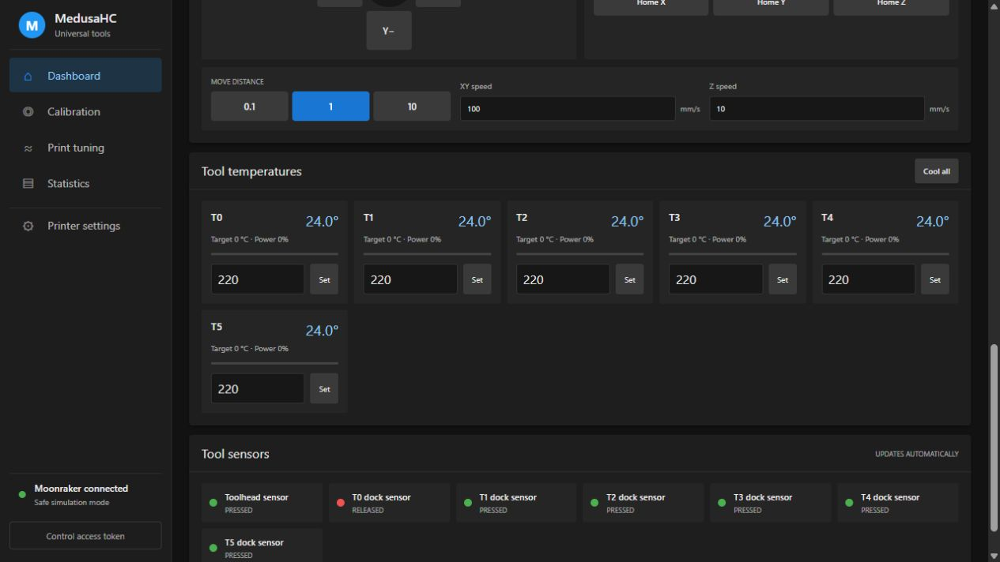
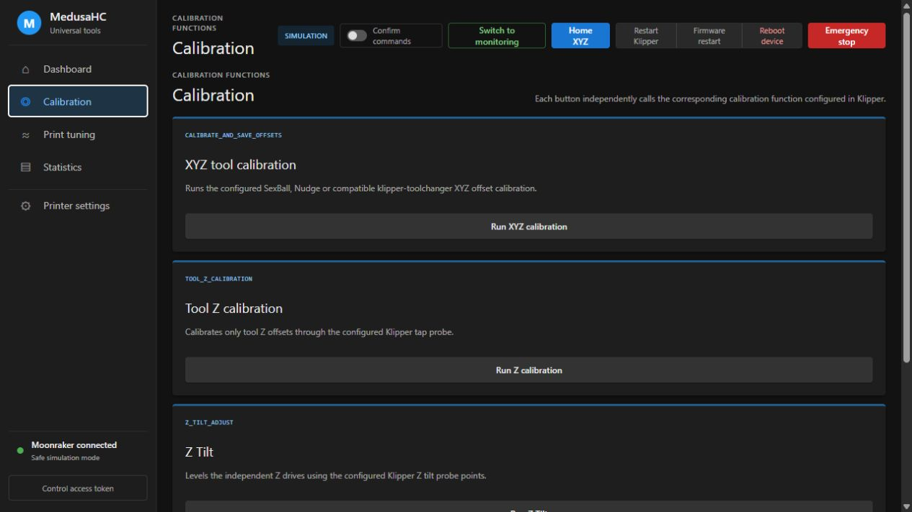
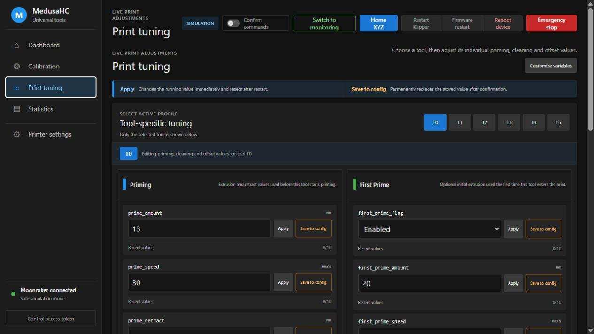
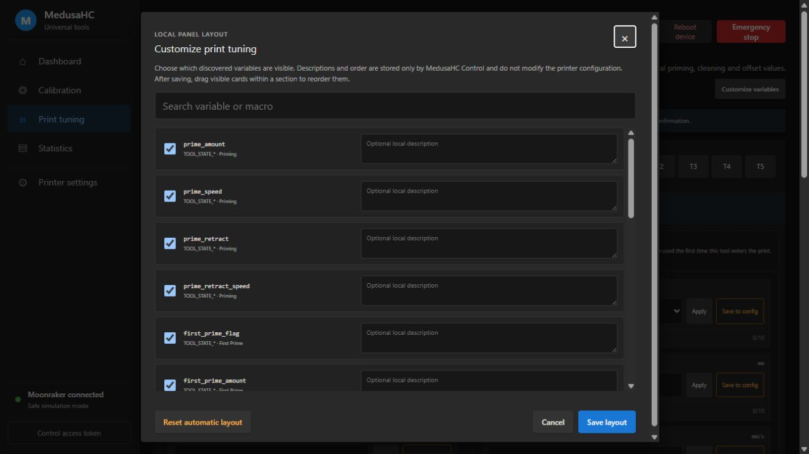
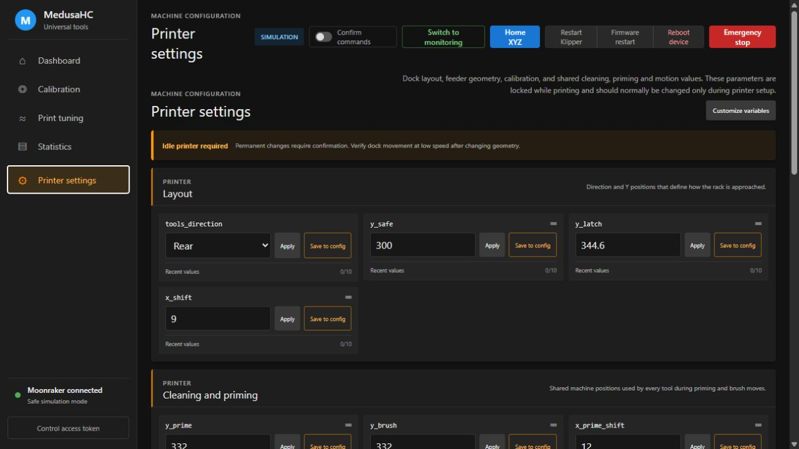
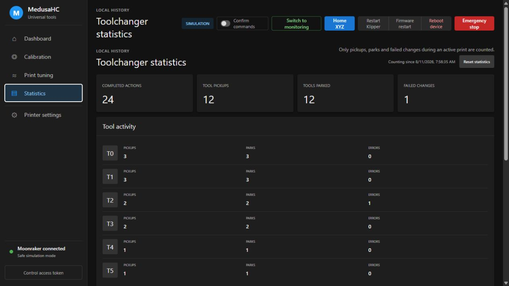

# MedusaHC Control user guide

MedusaHC Control is a separate web panel for everyday MedusaHC operation and
tuning. It runs next to Klipper, Moonraker, and Mainsail. It does not replace
Mainsail: keep Mainsail available for the normal printer controls, G-code
console, print files, and detailed Klipper diagnostics.

The screenshots in this guide were taken in the safe six-tool simulator. A
real printer will show its actual tool count, temperatures, sensors, camera,
coordinates, and front or rear dock layout.

> [!WARNING]
> The project is experimental. Check the printer visually before enabling live
> control. Keep the tool movement area clear and be ready to use Emergency Stop
> while testing a new configuration.

## Open the panel

After installation, open this address in a browser on the same network as the
printer:

```text
http://PRINTER_IP:PORT
```

The default port is `8090`. Use the different port selected during installation
if you changed it.

The interface works on a computer, tablet, or phone.



## First connection checklist

Start in monitoring mode and check the following before sending commands:

1. The lower-left connection indicator says **Moonraker connected**.
2. The displayed number of tools matches the printer.
3. The rack is shown on the correct side: front or rear.
4. Every dock sensor matches the real tool position.
5. The toolhead sensor correctly reports whether a tool is mounted.
6. Temperatures are reasonable and belong to the correct tools.
7. The camera view is correct, if a Moonraker webcam is configured.

Only enable live control after these checks pass.

## Monitoring and live control

The top bar is visible on every page.

- **Monitoring mode** reads printer information but does not allow ordinary
  movement or configuration commands.
- **Enable control** activates the available buttons. This is remembered only
  by the running panel service and does not bypass Klipper safety checks.
- **Confirm commands** adds a confirmation window before common movement
  commands. Leave it disabled if you prefer commands to be sent immediately.
- **Home XYZ** homes all axes.
- **Emergency stop** immediately sends the Klipper emergency-stop command.
- **Restart Klipper**, **Firmware restart**, and **Reboot device** always ask
  for confirmation because they interrupt printer operation.

Buttons can be disabled when Moonraker is disconnected, Klipper is not ready,
the panel is in monitoring mode, a print is active, or the tool sensors report
an unsafe combination.

## Dashboard

The Dashboard combines the controls most often needed during setup and normal
operation.



### Tool rack

The rack is generated from the tool count reported by MedusaHC. It is not fixed
to four or six tools.

- **Green** means the tool is parked in its dock.
- **Blue** means the tool is mounted on the toolhead.
- **Red** means the expected tool position is missing or ambiguous.
- The X coordinate shown on a parked tool is its configured dock coordinate.

Press **Select tool** to run the normal tool-selection macro for that tool. The
existing MedusaHC macros remain responsible for homing checks, feeder movement,
pickup, parking, and sensor validation.

### Current tool and feeder

The Current tool panel shows the mounted tool and the current feeder macro
state.

- **Park current tool** calls `DROP_TOOL`. It uses the complete MedusaHC drop
  procedure, including the configured feeder handling and checks.
- **Run cleaning cycle** calls the configured `CLEAN` macro.
- **Test all tools** calls `TEST_TOOLS` to run the printer's complete rack test.
- **Open feeder** calls `OPEN`.
- **Close feeder** calls `CLOSE`.

The panel does not reproduce these procedures internally. It calls the printer
macros, so improvements and safety checks inside the MedusaHC configuration
remain active.

### Camera

The camera panel uses the first enabled webcam reported by Moonraker. Camera
rotation, mirroring, aspect ratio, stream URL, and snapshot URL are taken from
the Moonraker webcam settings.

The simulator screenshot says **Camera unavailable** because it is not
connected to a real Moonraker webcam.

### Axis movement



The movement panel provides basic controls so simple setup work does not
require switching back to Mainsail.

- Home all axes or home X, Y, and Z separately.
- Select a movement distance of `0.1`, `1`, or `10` mm.
- Jog X/Y with the direction pad.
- Jog Z independently.
- Set separate XY and Z movement speeds.
- See the current X, Y, and Z position.

Each press sends one relative move. Manual movement is blocked during an active
or paused print.

### Tool temperatures and sensors



Each tool has its own current temperature, target, heater power, target input,
and **Set** button. **Cool all** sets every tool target to zero.

The sensor panel updates automatically:

- **Toolhead sensor** is the MedusaHC `e` sensor.
- **T0...Tn dock sensors** show whether each tool is present in its dock.

Always investigate a red or contradictory sensor state before moving the
toolchanger.

## Calibration



The Calibration page is a collection of independent macro buttons. It is not a
step-by-step wizard and it does not replace the configuration required by each
calibration method.

- **XYZ tool calibration** calls `CALIBRATE_AND_SAVE_OFFSETS`. Use it with the
  configured SexBall, Nudge, or another compatible klipper-toolchanger contact
  sensor.
- **Tool Z calibration** calls `TOOL_Z_CALIBRATION`. It is intended for the
  configured Klipper tap-probe procedure when only tool Z needs calibration.
- **Z Tilt** calls `Z_TILT_ADJUST`.
- **Bed calibration** calls the configured `BED_CALIBRATION` MedusaHC entry
  point.

Before starting, home the printer, clear the bed and movement area, verify the
probe, and keep Emergency Stop ready. A button can only work when the named
macro exists and is correctly configured in Klipper.

## Print tuning

Print Tuning contains values that may need adjustment for a material or while a
print is running. Choose the required tool tab before changing a tool-specific
value.



The automatic layout separates the common groups:

- **Priming**
- **First Prime**
- **Cleaning**
- **Offsets**

The exact variable names are shown to make comparison with the Klipper config
easy.

### Apply

**Apply** sends `SET_GCODE_VARIABLE` to the running Klipper instance. The new
value takes effect immediately and can be used to tune priming and cleaning
during a print.

The current MedusaHC configuration stores `fast_speed`, `slow_speed`, and
`clean_speed` in mm/s, but its movement macros use the corresponding
`GLOBAL_STATE` feedrates in mm/min. When one of these three speed fields is
applied, reset, or saved, the panel updates both values immediately:

- `fast_speed` also sets `fast_feedrate = fast_speed × 60`;
- `slow_speed` also sets `slow_feedrate = slow_speed × 60`;
- `clean_speed` also sets `clean_feedrate = clean_speed × 60`.

`fast_accel` is already used directly in mm/s² and is not converted. Older
MedusaHC configurations that do not contain the derived feedrate variable are
still supported; in that case the panel changes only the variable that exists.

This is temporary. Klipper reload or restart restores the value stored in the
configuration.

### Reset

**Reset** sends the value currently stored in `MHC_variables.cfg` back to the
running macro. For tool offsets, it uses the value currently stored by
Klipper's `[save_variables]` system. This reverses an accidental **Apply**
without writing either configuration file. The stored value is displayed below
the controls as **Saved config**. If the running and saved values differ, the
panel displays **Temporary value active**. This is expected after **Apply** and
is not a synchronization error. Reset is unavailable when no numeric stored
value can be read.

### Save to config

**Save to config** is permanent and always displays a warning before writing.

- Ordinary MedusaHC macro variables are replaced in the configured variables
  file. A timestamped backup is created first.
- Tool offsets are stored through Klipper `SAVE_VARIABLE` in the configured
  save-variables file.

Permanent file changes are blocked during an active or paused print.

### Recent values

Each field keeps the ten most recent values entered through the panel. Open
**Recent values** and select an old value to place it back into the input. It is
not applied until **Apply** or **Save to config** is pressed.

## Customize the variable panels



The panel starts with a useful layout for the current MedusaHC configuration;
it does not start empty. It also reads active numeric variables from the
configured MedusaHC variables file.

Press **Customize variables** to:

- search by variable or macro name;
- show or hide discovered variables;
- add an optional local description;
- keep uncommon internal variables hidden until they are needed.

Variables declared after a `Do not change` or `Do not edit` comment are treated
as internal runtime variables. They are not included in the automatic layout,
but they remain searchable and can still be added manually. The panel does not
forbid advanced access to them.

Visible cards are locked during normal use. To change their order, press
**Reorder variables** beside **Customize variables**, then drag cards inside one
section. Press **Finish reordering** when done. Moving a card does not reorder
other sections.

The same tool-variable layout is used for every tool. If a selected variable is
missing for one tool, its field is disabled and marked **Variable not found**.
The settings page continues working.

If a comment is written immediately above a variable declaration in the
configuration, the panel uses that comment as its description. A missing
comment simply means that no automatic description is shown.

Custom visibility, order, and descriptions are stored only in the local
MedusaHC Control database. They do not edit the printer configuration. Press
**Reset automatic layout** to return to the standard detected layout.
Normal package updates reuse this database and keep the customized variables,
order, visibility and descriptions. They are removed only by an explicit
layout reset, an uninstall with `--purge`, or manual database deletion.

## Printer settings



Printer Settings contains values that describe the machine rather than one
material or one print. These settings are locked while printing.

Depending on the installed configuration, this page can include:

- front or rear dock direction;
- `y_safe`, `y_latch`, and `x_shift` geometry;
- shared cleaning and priming coordinates;
- shared toolchange speeds and acceleration;
- feeder open/close movement and current settings;
- calibration values;
- individual `x_t0...x_tN` dock coordinates;
- additional discovered numeric variables selected through **Customize
  variables**.

Use **Apply** for a temporary test. Move slowly and verify every dock. Use
**Save to config** only after the geometry has been tested successfully.

## Statistics



Statistics are stored locally by MedusaHC Control. Only tool pickups, tool
parks, and failed changes observed while Klipper reports an active print are
counted. Manually removing a tool while the printer is idle does not fill the
failure counter.

The page shows:

- total completed pickup and park actions;
- pickup and park counts for each tool;
- failed changes;
- the date and time when counting started;
- recent counted activity.

**Reset statistics** clears these counters and starts a new counting period.
The numbers in the screenshot are demonstration data.

## What the panel changes

Simply opening and using the monitoring pages does not change printer
configuration files.

The panel changes printer state only when you deliberately send a command,
press **Apply**, or confirm **Save to config**. The locally stored database
contains statistics, recent field values, and the customized panel layout.

During installation, changes to `printer.cfg` and `moonraker.conf` are offered
as separate confirmation questions. Declining either question prints the
manual steps instead.

## Common problems

### Moonraker offline

Check that Mainsail can connect to the same printer. On the printer host, check
the panel service with:

```bash
sudo systemctl status medusahc-control
```

### Buttons are disabled

Check the connection, Klipper state, monitoring/live-control mode, print state,
and sensor states. Printer geometry and permanent configuration changes require
an idle printer.

### Variable not found

The panel intentionally disables only the missing field. Verify that the
correct MedusaHC variables file is configured and that the corresponding
`variable_NAME` exists in the expected Klipper macro. Restart Klipper after
manually changing macro declarations.

### Camera unavailable

Open the webcam settings in Mainsail and verify that at least one Moonraker
webcam is enabled and works there. Then press **Reconnect** in the camera panel
or reload MedusaHC Control.

### Wrong tool count

Verify `GLOBAL_STATE.variable_max_tool` in the running MedusaHC configuration.
The interface reads the tool count from Klipper and rebuilds the tool cards
automatically.

## Safe working habits

- Make a known-good backup before permanent tuning.
- Test new dock coordinates and directions at low speed.
- Keep Mainsail open during early testing.
- Never trust a displayed sensor state without checking the physical printer
  during initial setup.
- Do not run automatic calibration until its probe and movement coordinates
  have been verified.
- Stay near the printer during the first tool changes after any mechanical or
  configuration adjustment.
